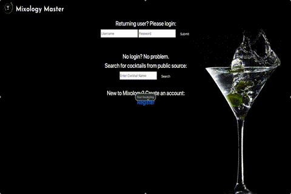

# Mixology Master

Mixology master is a server side application that was built using HTML, CSS, Bootstrap, Node.js, Express.js, Mustache and PostgreSQL. This website/app allows bartenders or anyone else who is mixing craft cocktails to quickly search for their favorite drink recipes. This project pulls from a public cocktail API which allows users to search for hundreds of recipes. Users can create an account, save their own drink recipies and leave comments on any of the public drink recipe.

### Live URL ###

https://mixologymaster.herokuapp.com/ (May take some time to load due to Heroku's sleep mode on free accounts)

### Demo ###

